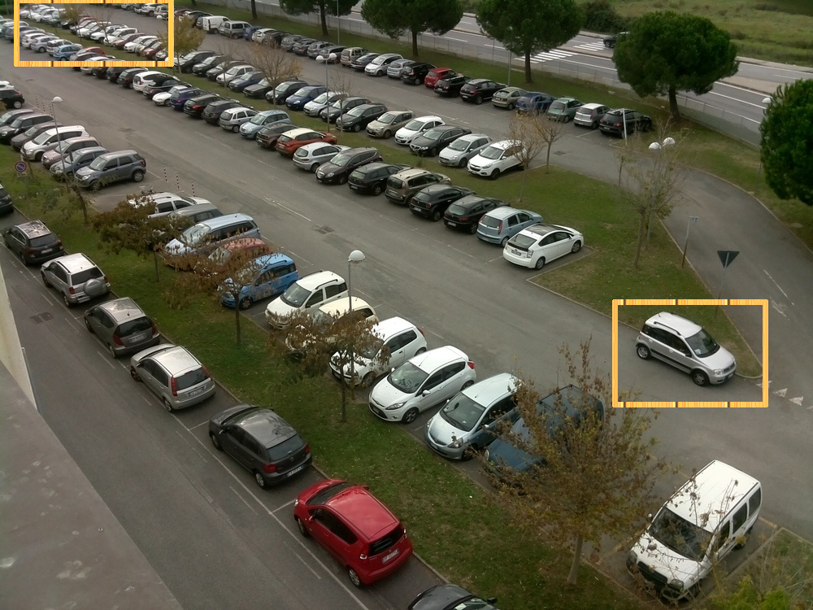

# Unsupervised Learning for Parking Detection
By Kushajveer Singh ([linkedin](https://www.linkedin.com/in/kushaj/), [blog](https://medium.com/@kushajreal), [github](https://github.com/KushajveerSingh), [twitter](https://twitter.com/Kkushaj))

This repo is the official pytorch implementation of "**Upsupervised Learning for Parking Detection**" (arXiv paper and blog post coming soon). It is based on a **modular approach** where you can change the blocks according to your need.

# Introduction
Parking Space Detection is a very important task in the field of computer vision as there is a general dearth of parking spaces toady and it takes time to explore the parking spaces as parking spots start filling up. By solving this problem we can reduce the car emissions in urban centers by reducing the need for people to needlesly circle city blocks for parking. It also permits cities to carefully manage their parking supply and finally it reduces the daily stress associated with parking spaces.

My implementation is based on the methodology that with the continous advances in the field of computer vision a lot of new and more efficient and accurate models are being introduced and we should be able to use these models directly off the shelf without any fine-tuning. So I present my unsupervised method of doing parking detection.

# General overview of my approach

My implementation can be divided into these three modules:
1. **Object Detection Module** :- Use COCO pretrained model, no need to do finetuning.

2. **Label Processing Module** :- As out model is not finetuned, there are some tricks that I add to overcome these limitations

3. **Classification Module** :- Use the processed labels/bounding_boxes to tell if that parking space is occupied or not.

# Details of various modules:
1. **Object Detection Module** :- This module is responsible for detecting the cars in an image. Why is this important? Because it is the cheapest way of getting the location of parking spaces directly from an image. This modele only assumes that the images that you provide for learning the parking spaces should not contain images of cars that are not in a parking space.

    This assumption is necessary so as to reduce the complexity of the task. If we were to remove this assumption than techniques like motion tracking would have to be used and also as we are not using fine-tuned models there would be problems with that also.

    Why not use fine-tuned model? You can finetune your model. But in order to show the generalization power of this approach, I refrained from finetuning my model. So t oovercome the limitations of pretrained models, I use the following approaches:
    * Use multiple images for getting the parking spaces
    * Split the image into a 3x3 grid of overlapping regions so as to get more occurate bounding boxes. 
    
    By using the above two methods the need for fine-tuning is essentially removed and as a result of this **you don't need any data for Parking Lot Detection** thus making it an example of unsupervised learning.

    By using this technique there is no need to do any kind of feature engineering for getting the parking spaces, as the earlier research focused on using lane markings as an indicator of parking spaces, but as you can see in the bottom right of the figure there are some cases, where there are no lane markings but they are considered as standard parking spaces.

    

2. **Label Processing Module** :- I use label to refer to the bounding boxes produced by the object detection model. Now to process the labels/bounding boxes we require this module. This module mainly solves the following:
    * Combine bounding boxes from multiple images
    * Combine bounding boxes from the multiple splits of an image with the original image
    * Techniques to remove all the redundant and overlapping bounding boxes and cleaning the labels.

3. **Classification Module** :- This module takes as input the processed labels as produced by the Label Processing Module and classifies the patches of bounding boxes as occupied or not.

# How to extend these modules
1. **Object Detection Module** :- This repo used [M2Det](https://arxiv.org/abs/1811.04533) as a object detection model. If you want to use some other model for object detection all you need to do is clone the source code of the model and run the inference script.

    1. Refer to the [Directory Structure](#directory-structure) for details on how to setup up your directory.
    2. Clone the source code of your object detction model in `src/`
    3. Refer to the model instructions on how to do inference for your images. The final output should be a dictionary such that `locs[img_path] = [list of bounding boxes for that image]` and the bounding boxes should be `(x_min, y_min, x_max, y_max)` i.e. topleft corner and bottom right corner. And the dictionary should be stored as binary pickled object as
        ```python
        f = open('save_name.txt', 'wb')
        pickle.dump(locs)
        f.close()
        ```
        Refer to `src/m2det/parking_detect_split.py` on how I modified the script for the above cases.

2. **Label Processing Module** :- No changes need to be made here

3. **Classification Module** :- `src/scripts/classify_patches.py` performs this step and the following loads the desired model.
    ```python
    model = load_model()
    ```

    So to use another model you just need to define a function that returns your model. The code for my `load_model()` is as follows
    ```python
    def load_model():
        # By default the model is loaded on CPU
        model = resnet50()
        model.load_state_dict(torch.load('src/scripts/f_classifier.pth'))
        model.eval()
        return model
    ```

# Directory Structure
To make things easier I made the following directory structure. There are two main folder `Data/` and `src/`. 

The `Data/` folder contains the following:
* labels :- This folder contains all the labels/bounding_boxes that our object detection model would produce. This would also contain the labels processed by the Label Processing Module. The labels are written as binary pickled files by default. Every label has the following terminology 
    * `{name_of_parking_space}.txt`for the labels produced by object detection moduule (e.b.`pakring1.txt`)
    * `{name_of_parking_space}_processed.txt` for the labels produced by the label processing module (e.b. `parking1_processed.txt`)
* folders for each parking space. I named all my parking spaces as `parking1`, `parking2`, and so on. In case I split the image into a 3x3 grid then the folder looks like `parking1_split`
* parking1 :- Each parking space has further 2 folders
    * train :- these contains the images that I use for getting the parking spaces for that parking space. By default various results are also stored here by default.
        1.  *_m2det.jpg :- These are the images saved by m2det object detection model with the bounding
        boxes as predicted by m2det.
        2.  *_split.jpg :- These are the images that we get after spliting our original image into 
            smaller 3x3 images
        3.  *_result.jpg :- These are the images that are saved after processing the labels. So these
            images contain the final bounding boxes that our classifier model will use.
    * test :- These contains the images that I use for testing my model for that parking space. So if an image has the following name `image1.jpg` then the result of my model is stored as `image1_result.jpg`.

The `src/` has the following structure
* m2det :- This is the github clone of the official m2det implementation. Redundant code has been removed and the model has been converted to PyTorch1.0
* scripts :- All the scripts that I use in this project.

# Requirements
* Python 3.6+
* Pytorch 1.0+
* skimage
* imageio
* OpenCV

# Install
1. Install PyTorch 1.0 and torchvision from the following [official instructions](https://pytorch.org/).
2. To install the other dependencies use the following instructions
    ```
    # If using pip
    pip install numpy
    pip install matplotlib
    pip install imageio
    pip install scikit-image
    pip install opencv-python
    ```

    ```
    # If using conda
    conda install -c anaconda numpy
    conda install -c conda-forge matplotlib
    conda install -c conda-forge opencv
    conda install -c menpo imageio 
    conda install -c conda-forge scikit-image
    ```
3. Download the m2det [official weights](https://drive.google.com/file/d/1NM1UDdZnwHwiNDxhcP-nndaWj24m-90L/view) and place them in `src/m2det/weights/`.

# Software environment which I used for testing
* Python 3.7.3
* PyTorch 1.0.1
* CUDA 10.0
* CUDNN 7.3.1
* OpenCV 4.0
* skimage 0.15.0
* imageio 2.5.0

# How to test for own parking space
1. Follow the [Directory Structure](#directory-structure) to setup your own parking space. For this example I use `parking1` as my parking space.
    
    So I created folder `Data/parking1` and then create `Data/parking1/train` and `Data/parking1/test`. Place the images for getting the parking space in the `train` folder and the images for testing in the `test` folder.

2. To split the images run
    ```
    python src/scripts/split_images.py -f=parking1
    ```
3. Now we use Object Detection Module i.e. get M2Det predictions.
    ```
    python src/m2det/parking_detect_split.py -f=parking1 --save --show
    ```
4. Now we use the Label Processing Module
    ```
    python src/scripts/process_labels.py -f=parking1
    ```
5. Now we use the Classification Module
    ```
    python src/scripts/classify_patches.py -f=parking1 --show --save --cuda
    ```

For knowing what these scripts do I have a DEMO.md is provided. But the the code that DEMO.md used is slightly different from the above cases. It uses an alternate implementation where you don't want to split the images.