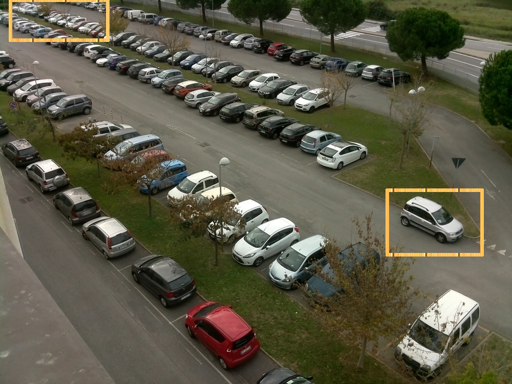

# Unsupervised Learning for Parking Detection
By Kushajveer Singh ([https://kushajveersingh.github.io](https://kushajveersingh.github.io/))

This repo is the official pytorch implementation of "**Upsupervised Learning for Parking Detection**" (arXiv paper and blog post coming soon). It is based on a **modular approach** where you can change the blocks according to your need.

Currently, this repo implements the following
* Parking Space Detection
* Pakring Space Occupancy Detection
* Color of car in a parking space
* Pose of car in a parking space

# Table Of Contents
1. [Introduction](#introduction)
2. [General overview of my approach](#general-overview-of-my-approach)
3. [Details of various modules](#details-of-various-modules)
4. [How to extend these modules](#how-to-extend-these-modules)
5. [Model Improvements](#model-improvements)
5. [Directory Structure](#directory-structure)
6. [Testing Environment](#testing-environment)
7. [How to run on your own data](#how-to-run-on-your-own-data)

# Introduction
Parking Space Detection is a very important task in the field of computer vision as there is a general dearth of parking spaces toady and it takes time to explore the parking spaces as parking spots start filling up. By solving this problem we can reduce the car emissions in urban centers by reducing the need for people to needlesly circle city blocks for parking. It also permits cities to carefully manage their parking supply and finally it reduces the daily stress associated with parking spaces.

My implementation is based on the methodology that with the continous advances in the field of computer vision a lot of new and more efficient and accurate models are being introduced and we should be able to use these models directly off the shelf without any fine-tuning. So I present my unsupervised method of doing parking detection.

# General overview of my approach

My implementation can be divided into these three modules:
1. **Object Detection Module** :- Use COCO pretrained model, no need to do finetuning.

2. **Label Processing Module** :- As out model is not finetuned, there are some tricks that I add to overcome these limitations

3. **Classification Module** :- Use the processed labels/bounding_boxes to tell if that parking space is occupied or not.

# Details of various modules
1. **Object Detection Module** :- This module is responsible for detecting the cars in an image. Why is this important? Because it is the cheapest way of getting the location of parking spaces directly from an image. This module only assumes that the images that you provide for learning the parking spaces should not contain images of cars that are not in a parking space.

    This assumption is necessary so as to reduce the complexity of the task. If we were to remove this assumption than techniques like motion tracking would have to be used and also as we are not using fine-tuned models there would be problems with that also. Or using a count based approach, but that would significantly increase the labeling cost.

    Why not use fine-tuned model? You can finetune your model. But in order to show the generalization power of this approach, I refrained from finetuning my model. So to overcome the limitations of pretrained models, I use the following approaches:
    * Use multiple images for getting the parking spaces
    * Split the image into a 3x3 grid of overlapping regions so as to get more occurate bounding boxes. 
    
    By using the above two methods the need for fine-tuning is essentially removed and as a result of this **you don't need any data for Parking Lot Detection** thus making it an example of unsupervised learning.

    By using this technique there is no need to do any kind of feature engineering for getting the parking spaces, as the earlier research focused on using lane markings as an indicator of parking spaces, but as you can see in the bottom right of the figure there are some cases, where there are no lane markings but they are considered as standard parking spaces.

    

2. **Label Processing Module** :- I use *label* to refer to the bounding boxes produced by the object detection model. Now to process the labels/bounding boxes we require this module. This module mainly solves the following:
    * Combine bounding boxes from multiple images
    * Combine bounding boxes from the multiple splits of an image with the original image
    * Technique to remove the redundant and overlapping boudning boxes from the images

3. **Classification Module** :- This a combination of 3 models. All the models have been trained on custom datasets, which you can find in the `data` folder.

    First module is responsible for the classification of patches (that we get after the Label Processing Module) as occupied or not. This is a Resnet50 with a custom head.

    Second module is responsible for getting the color of the car in that patch. The colors include, White-0, Silver-1, Black-2, Grey-3, Blue-4, Red-5, Brown-6, Green-7, Others-8. This is a Resnet50 with a custom head.

    Third module is responsible for getting the pose of the car in the patch. There are three poses possible,front facing (0), back facing (1) or side ways (2).

# How to extend these modules
1. **Object Detection Module** :- This repo used [M2Det](https://arxiv.org/abs/1811.04533) as a object detection model. If you want to use some other model for object detection all you need to do is clone the source code of the model and run the inference script provided in the README of the repo.

    1. Refer to the [Directory Structure](#directory-structure) for details on how to setup up your directory.
    2. Clone the source code of your object detction model in `src/`
    3. Refer to the model instructions on how to do inference for your images. The final output should be a dictionary such that `locs[img_path] = [list of bounding boxes for that image]` and the bounding boxes should be `(x_min, y_min, x_max, y_max)` i.e. topleft corner and bottom right corner. And the dictionary should be stored as binary pickled object as
        ```python
        f = open('save_name.txt', 'wb')
        pickle.dump(locs)
        f.close()
        ```
        Refer to `training/m2det/detect_parking_spaces.py` on how I modified the script for the above cases.

2. **Label Processing Module** :- No changes need to be made here.

3. **Classification Module** :-
    To use another model you just need to define a function that returns your model. The code for my `get_color_model()` is as follows
    ```python
    def get_color_model():
        # By default the model is loaded on CPU
        model = resnet50()
        model.load_state_dict(torch.load('training/color_classifier.pth'))
        model.eval()
        return model
    ```

# Model Improvements
1. [EfficientNet](https://ai.googleblog.com/2019/05/efficientnet-improving-accuracy-and.html):- It can be considered as the next revolutionary model after ResNet. It shows promising results. It is officially implemented in Tensorflow, but work is going on to reproduce the training results on Imagenet in PyTorch. This model with one-eight of parameters as Resnet-152 has better top-1 accuracy.

2. Apart from Classification models, an object detection model with EfficientNet can also be made. 

3. I have previously tested with YOLO and RefineNet models for my Object Detection Module also, and the results are similar. It is possibly due to the powerful Label Processing Module.

    ***Note**: The only reason I used M2Det model here, was because it was a new paper at that time and I was very impressed by the technique that they discussed in the paper.*


# Directory Structure
1. `data` folder:
    
    * `color` and `Color`. These folders contain the custom dataset that I used to train my model for color detection.  I first trained on `color` and then fine-tuned on `Color`.

    * `Pose` contains the custom dataset that I used for detecting the pose of a car in an image.

    * `images` contains `out.mp4` and `test.jpg`. `out.mp4` is used to get the locations of parking spaces in an image and `test.jpg` is used to test our model for that parking space location.

    * `annotations` contains `annotations.json` which contains the label file for `test.jpg`

    * The temporary datasets are also created in this directory. (Details for it are available further)

2. `docs` folder:

    * `README.md`
    * `presentation.pdf` or `presentation.odf`
    * `Extras`: These are the images that I included in the presentation and README.

3. `training` folder:

    * `m2det` This if a github clone of the official [repo](https://github.com/qijiezhao/M2Det), except the code has been converted from PyTorch0.4 to PyTorch 1.1 and all the redundant code has been removed. A custom inference script, `detect_parking_spaces.py` has also been created to meet my specific needs.

    * The weights for the Pose detection, Color Detection and Occupancy Detection models are stored here as `*_classifier.pth`

    * Scripts for creating the models are also placed here as `*_classifier.py`

    * `inference.py` The inference script I used to get the final predictions from the models

    * `notebooks` folder. The jupyter notebooks I used when coding up this project. (not maintained)

4. `requirements.txt`. The main requirements for this project include

    * PyTorch
    * torchvision
    * Python OpenCV
    * imageio
    * Numpy
    * Matplotlib
    
    There are some additional dependencies but they are only needed for M2Det.

5. `model.py`. Main script that contains wrapper for the complete project.

# Testing Environment
* Ubuntu 18.04 LTS
* Python 3.7.3
* Numpy 1.16.4
* matplotlib 3.1.0
* OpenCV 4.0.0
* imageio 2.5.0
* PyTorch 1.1.0
* torchvision 0.3.0

# How to run on your own data
You have to manually download the object-detection model weights. You can download the weights from this [link](https://drive.google.com/file/d/1NM1UDdZnwHwiNDxhcP-nndaWj24m-90L/view). After downloading them place the weights in `training/m2det/weights`.

`model.py` takes the following arguments. These arguments are same for the `Model` class defined in the `model.py`.

| Name | default | description|
| -- | -- | -- |
| dir | data/temp | Name of directory to store intermediate results like detection result images|
| make_splits | False | If true, then all your images would be split into 3x3 grid and the training would be done on those 3x3 + 1(original image) |
| gpu | False | If True, then the training is done on GPU |
| detection_thresh | 0.2 | The detection thresold for the object detection model, so as to detect the cars in the image |
| detection_save | False | If True save the images with predicted bounded boxes to disk (location is `dir/detection_images`) |
| detection_show | False | If True show the images with the predicted bounded boxes in a new window (there is some delay also) |
| label_thresh | 0.5 | The threshold for the maximum relative overlap between two bounding boxes that is allowed |
| label_save | False | If True save the images with the merged bounding boxes to disk (location is `dir/labels_images`)
| label_show | False | If True show the image with the merged bounding boxes in a new window |

As an example, I already have the video and image input in the `data/images` folder. So to run my program on this data, use this command
```
python model.py --video-path=data/images/out.mp4 
```

The `Model` class follows the same structure. Ideally, you don't need to change any values in the constructor. You can directly call the `Model.predict()` method
```python
    def predict(self, video_path, x:np.ndarray=None):
```